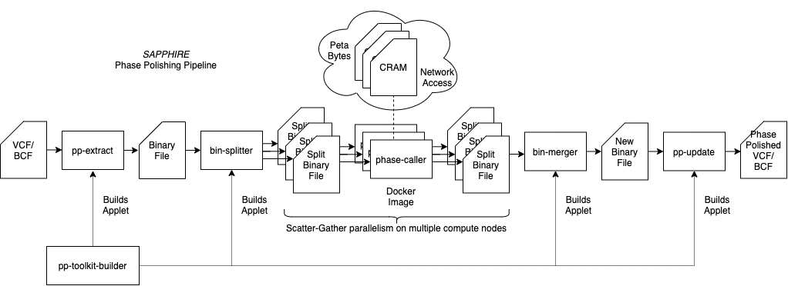

# SAPPHIRE and the PP-Toolkit

**Smart and Accurate Polishing of Phased Haplotypes Integrating Read Enhancements (SAPPHIRE)**

Paper : *Improving population scale statistical phasing with whole-genome sequencing data*

Link (open-access) : https://journals.plos.org/plosgenetics/article?id=10.1371/journal.pgen.1011092

If you use SAPPHIRE in your research please cite :

```
@article{wertenbroek2024improving,
  title={Improving population scale statistical phasing with whole-genome sequencing data},
  author={Wertenbroek, Rick and Hofmeister, Robin J and Xenarios, Ioannis and Thoma, Yann and Delaneau, Olivier},
  journal={PLoS genetics},
  volume={20},
  number={7},
  pages={e1011092},
  year={2024},
  publisher={Public Library of Science San Francisco, CA USA}
}
```

**Phase Polishing Toolkit**

- Improve phased haplotypes with whole genome sequencing reads.
- Benchmark phased haplotypes with whole genome sequencing reads.

Written to scale with massive population scale data and run on the UK Biobank research access platform (RAP).

## Pipeline Diagram



## Directory Structure

- `bin_tools` : Tools to query, split, merge a sparse binary format file for extract heterozygous variants.
- `diagrams` : drawio diagrams.
- `dnanexus_app` : Apps to deploy on the UK Biobank DNANexus RAP, allows to run the tools on the RAP via their interface.
- `dnanexus_scripts` : Scripts to launch jobs on the UK Biobank DNANexus RAP from a computer through the `dx-toolkit`.
- `Docker` : Dockerfile and scripts to create a docker image for the actual phase polishing on the RAP.
- `include` : Shared headers
- `phase-caller` : Source of the phase-caller that does the actual phase polishing given sparse binary file and CRAM file path
- `pp_extractor` : Source of tool to extract heterozygous variants from VCF/BCF and generate sparse binary format file.
- `pp_update` : Source of tool that updates VCF/BCF file with phase polished heterozygous variants from sparse binary file.
- `test` : Unit and Integration Testing folder.

## DNANexus RAP Build instructions

For the DNANexus Research Analysis Platform (RAP) an applet `pp-toolkit-builder` to build the other applets is provided. This applet can be built locally (requires [dx-toolkit](https://github.com/dnanexus/dx-toolkit)) or directly from a "ttyd" instance on the RAP. Once this `pp-toolkit-builder` applet is built, the others can be built from the RAP interface directly.

### Steps to build to PP-toolkit builder and run it to build the applets

1) Start analysis and select `ttyd`. Any instance type is acceptable, we recommend `mem2_ssd2_v2_x2`.
2) Access the `ttyd` terminal with the "Open Worker URL" button from the job monitor.
3) Run the following commands.

```shell
git clone https://github.com/rwk-unil/pp.git
cd pp
dx build dnanexus_app/pp-toolkit-builder
```

4) Check that the `pp-toolkit-builder` applet appeared in your output folder on the RAP.
5) You can now terminate the `ttyd` job.
6) Launch the `pp-toolkit-builder` applet by double clicking on it.
7) Select an output folder for the applets and launch the job.
8) Once finished (build time should be less than 10min) the applets will be available in the chosen output folder.

### Build and upload the docker image

```shell
cd Docker
wget https://github.com/rwk-unil/pp/releases/download/prelim/hts-ref.zip
docker build -t pp-toolkit:v1.4 -f Dockerfile_fat2
docker save pp-toolkit:v1.4 | pigz --fast > pp_toolkit_v1.4.tar.gz
```

Note, if you don't have pigz you can use gzip but it will take more time
```shell
docker save pp-toolkit:v1.4 | gzip > pp_toolkit_v1.4.tar.gz
```

Upload the `pp_toolkit_v1.4.tar.gz` to you project on DNANexus e.g., under a `docker` directory.

## Running the pipeline

The pipeline diagram above presents a general overview of the different tasks.

To illustrate with an example let's assume we want to polish a file named `chr20.bcf` previously **phased with SHAPEIT5**.

1) The `pp-extract-applet` applet takes a VCF or BCF file that has been phased with [SHAPEIT5](https://github.com/odelaneau/shapeit5) and outputs three files, a text file with the sample names, a BCF file with variants only, and a sparse binary file with the extracted heterozygous variant sites. We recommend choosing an output folder like `SAPPHIRE/step1_extraction/chr20/`. For extremely big input files (e.g., hundreds of thousands of samples) we recommend to launch the job with high priority so that it is not interrupted and relaunched. Choose an instance type with enough storage to be able to hold the input VCF/BCF file.
2) (Optional) If the input file has more than a thousand samples we recommend splitting the binary files so that the phase calling can be done on multiple compute nodes. The tool for this is `bin-splitter-applet`. This applet takes the binary file generated in the previous step and splits it into binary files of 1000 samples (this number can be changed as an option of the applot). We recommend outputting to a folder like `SAPPHIRE/step2_splitting/chr20/`. This is a very fast step and takes less than a few minutes.
3) The phase calling software should be run as a Docker image (see above to build). The script to launch it from a host with the [dx-toolkit](https://github.com/dnanexus/dx-toolkit) software (or from a `ttyd` instance, can be terminated once launched) is `dnanexus_scripts/run_phase_caller.sh` or `dnanexus_scripts/run_phase_caller_batch.ch` to launch all the jobs for the split binary files. This should be run with the following options :

```shell
./run_phase_caller.sh --project-id <PROJECT ID> --destination SAPPHIRE/step3_phase/chr20/ --vcf-id file-xxxyyyzzz1234567890abcde --bin-id file-xxxyyyzzz1234567890abcde --samples-id file-xxxyyyzzz1234567890abcde
```

- The `--project-id <PROJECT ID>` is the number after the sample ID on the CRAM files. E.g., `project-xxxyyyzzz1234567890abcde:/Bulk/Whole genome sequences/Whole genome CRAM files/10/1000580_12345_0_0.cram` here represented by `12345` so the option would be `--project-id 12345`, this is required so that the software can generate the CRAM file name from the sample list.
- The `--destination <folder>` is the destination folder for the outputs, e.g., `SAPPHIRE/step3_phase/chr20/`
- The `--vcf-id` is the ID of the BCF file generated by the `pp-extract-applet` (e.g., `SAPPHIRE/step1_extraction/chr20/chr20.bcf_vars.bcf`), it can be copied from the file manager information tab in the DNANexus RAP.
- The `bin-id` is the file ID of the binary file generated by the `pp-extract-applet` (e.g., `SAPPHIRE/step1_extraction/chr20/chr20.bcf_hets.bin`), pass the file ID of this file.
- The `samples-id` is the file ID of the sample list text file generated by the `pp-extract-applet` (e.g., `SAPPHIRE/step1_extraction/chr20/chr20.bcf.samples.txt`), pass the file ID of this file.

Optional options are :
- `--cram-path` if the CRAM path differs from `/mnt/project/Bulk/Whole genome sequences/Whole genome CRAM files` (`/mnt/project` is the mount point for the project files in the docker containers). **CRAM filenames are created from sample IDs and project ID e.g., for sample 1234567 from project abcdef, the cram file `<cram-path>/12/1234567_abcdef_0_0.cram` will be loaded**. This is specific to the UKB RAP.
- `--samples-list-id` if only a subset of the samples need to be rephased, this is the file ID of a subset list.
- `--threads` the number of threads to use, because the CRAM files are accessed over the network we recommend to use more threads than cores in the instance type, by default this is set to 12 because it works well for the default `mem2_ssd1_v2_x4` instance. We recommend to set this to three times the cores of the instance used (this can be fine tuned by looking at the CPU usage in the logs).
- `--instance` allows to chose another instance type (should not be necessary), default is `mem2_ssd1_v2_x4`.
- **important** `--docker-image` if your docker image is named or located different than `docker/pp_toolkit_v1.4.tar.gz` in your DNANexus project you can provide it here.

If the binary file has been split the following script is used instead :
```shell
./run_phase_caller_batch.sh --project-id <PROJECT ID> --destination SAPPHIRE/step3_phase/chr20/ --vcf-id file-xxxyyyzzz1234567890abcde --bin-id file-xxxyyyzzz1234567890abcde --samples-id file-xxxyyyzzz1234567890abcde
```

The options are the same with the difference that this script will generate a job for all file in the same directory as the file defined by `--bin-id`, so this can be any of the split binary files. For example if 200,031 samples are split into 201 binary files of up to 1,000 samples per file, this will generate 201 jobs. The script will ask for confirmation before launching all the jobs. `run_phase_caller_batch.sh` has an extra option `--tag` that allows to tag the jobs.

Note, the phase caller is run as a Docker image on a `swiss-army-knife` type instance because the applet crashes on network errors, the Docker does not and the `phase_caller` program will detect network errors thanks to the checksums of the blocks inside the CRAM files (the only files accessed over network) and retry.

4) (Optional) If the binary files were split, the `bin-merger-applet` allows to reassemble them. This has to be run on the "phase called" binary files e.g., in `SAPPHIRE/step3_phase/chr20/`, select them all. This is very fast step and takes less than a few minutes. Chose an output directory e.g., `SAPPHIRE/step4_merge/chr20`.

5) With the final rephasd binary file available, either after step 3) directly or after reassembling in step 4). We can now update the initial VCF/BCF to generate the final output BCF. The `pp-update-applet` requires the original VCF/BCF file, and the rephased binary file. It will generate a new BCF file with all rephased heterozygous variant sites updated and index it, so the index will also be generated. This can take a long time (because it has to decompress the initial VCF/BCF and compress the new generated BCF file) so run at high priority. The instance type has to have enough storage to accomodate twice the size of the original VCF/BCF at least. Chose an output folder e.g., `SAPPHIRE/step5_update/chr20`.

The final rephased BCF files are now available and indexed. Congratulations !

## Local Build instructions

```shell
# Build the SAPPHIRE PP-Toolkit tools
make
```

## Local run instructions

To run the programs locally there is no need to create "applets", "Docker images" etc. The programs can be run directly, you get the options by running the programs with the `-h` flag.

### Note for CRAM names for local run

The way the `phase_caller` program searches for CRAM files is very specific (because it had to load thousands of CRAMs from UKB) : CRAM filenames are created from sample IDs and project ID e.g., for sample `1234567` from project `abcdef`, the cram file `<cram-path>/12/1234567_abcdef_0_0.cram` will be loaded. So unless your CRAM files have this path (you can do so with symbolic links for example), the CRAM files will not be found.

There is a version that allows to load a sample list with the CRAM path directly written inside the sample list file under the branch https://github.com/rwk-unil/pp/tree/phase_caller_generic_no_path the `phase_caller2` program. It is not yet merged into the main branch.

This allows to use a sample list that instead of containing only the sample ID, allows to enter three parameters :
```
<index in bin file>,<sample name>,<path to individual CRAM file>
```

So for example for a VCF/BCF with samples `HG001, HG002, HG003, HG004` that got extracted to a binary file, and you are interested in phase calling only `HG002` and `HG004` with CRAM files that don't follow the UKB naming convention you can use a sample list as : 
```
1,HG002,/home/user/crams/HG002.cram
3,HG004,/mnt/network/somewhere/HG004_sequencing_file.cram
```

(The index in the binary file follows the order of samples in VCF/BCF so `HG001, HG002, HG003, HG004` would be `0,1,2,3`).

Do not add extra spaces.
