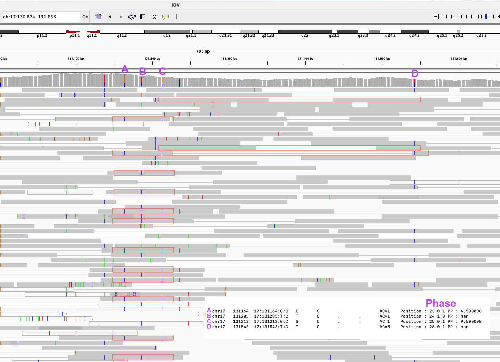

# Examples for running SAPPHIRE

Note: The instructions here are not for population-scale but serve as examples on how to rephase specific genotypes, for a number of samples. This can serve as a base for running SAPPHIRE rephasing on genotypes based on conditions chosen by the user.

Note: If your file is already phased with SHAPEIT5 it will already have the PP (Phasing Probability) confidence score, and you can directly use `pp_extract` to extract low-confidence phased variants to rephase. For population scale projects you can also use minor allele frequency threshold (based on AC/AN in the VCF/BCF) directly. Here we show how to manually set a PP value to extract chosen genotypes.

Note: The instructions for running on the DNANexus platform are on main [README](../README.md).

**Reference documentation for bcftools:** https://samtools.github.io/bcftools/bcftools.html

Data can be downloaded from http://ftp.1000genomes.ebi.ac.uk/vol1/ftp/data_collections/1000G_2504_high_coverage/working/20220422_3202_phased_SNV_INDEL_SV/

The examples below are on chromosome 17 for samples `NA12778,NA12878,NA12889`.

The data is converted to BCF for faster processing
```shell
bcftools view 1kGP_high_coverage_Illumina.chr17.filtered.SNV_INDEL_SV_phased_panel.vcf.gz -Ob -o 1kGP_high_coverage_Illumina.chr17.filtered.SNV_INDEL_SV_phased_panel.bcf
bcftools index 1kGP_high_coverage_Illumina.chr17.filtered.SNV_INDEL_SV_phased_panel.bcf
```

# Rephase a chosen subset of genotypes

## Annotating BCF files to rephase a specific set of genotypes

Generate a file with your samples of interest, here I pass through bcftools filter to remove lines where all the samples are homozygous, removing these lines is optional.

```shell
bcftools view 1kGP_high_coverage_Illumina.chr17.filtered.SNV_INDEL_SV_phased_panel.bcf -s "NA12778,NA12878,NA12889" -Ou | bcftools filter -e 'INFO/AC=0' -Ob -o sapphire_test/1kGP_NA12778_NA12878_NA12889.bcf
```

### Example rephasing genotypes with low allele frequency

If we want to rephase all heterozygous sites with a low allele frequency (requires `INFO/AF` field) we will annotate them with the `PP` FORMAT field with a value of `0.5`.

To do so we will use bcftools annotate, this will require a `.tsv` (tab separated values) file and a header. We will create them as follows :

```shell
# Extract all variants with AF < 0.01 and replace heterozygous by "0.5" and homozygous by "."
bcftools filter -i 'INFO/AF<0.01' 1kGP_NA12778_NA12878_NA12889.bcf -Ou | bcftools query -f '%CHROM\t%POS\t%ID\t%REF\t%ALT\t[%GT\t]\n' | sed -e 's/0|0/./g' -e 's/0|1/0.5/g' -e 's/1|0/0.5/g' -e 's/1|1/./g' > pp_info.tsv
# bgzip and tabix annotate the file
bgzip pp_info.tsv
tabix -s1 -b2 -e2 pp_info.tsv.gz
```

Create header.txt with the following info inside :

```
##FORMAT=<ID=PP,Number=1,Type=Float,Description="SHAPEIT Phasing Probability (PP) field">
```

Annotate the BCF file with :

```shell
bcftools annotate -a pp_info.tsv.gz -h header.txt -c CHROM,POS,ID,REF,ALT,FORMAT/PP \
        1kGP_NA12778_NA12878_NA12889.bcf -Ob -o 1kGP_NA12778_NA12878_NA12889_PP_annotated.bcf
```

You can check the result with

```shell
bcftools view 1kGP_NA12778_NA12878_NA12889_PP_annotated.bcf | less
```

and you will see lines where the PP value of 0.5 has been added.

```
chr17   119009  17:119009:C:G   C       G       .       PASS    AC=1;AF=0.00811992;AN=6      GT:PP   0|0:.   0|0:.   0|1:0.5
```

### Choosing genotypes to rephase with other conditions

Note that if you have very few variants you want to rephase, you could also create the `.tsv` file by hand.

If you have more specific requirements you can write a script or program to fill the PP field.

### Extracting the PP=0.5 annotated variants and surrounding common

You can now extract the variants with the low PP

```shell
./sapphire/pp_extractor/pp_extract -f 1kGP_NA12778_NA12878_NA12889_PP_annotated.bcf --show-number -o 1kGP_NA12778_NA12878_NA12889_PP_extract.bin
# Copy the file as SAPPHIRE will modify it, with this we will be able to compare
cp 1kGP_NA12778_NA12878_NA12889_PP_extract.bin 1kGP_NA12778_NA12878_NA12889_PP_extract.bin.original
```

```
Extracting...

Start ID : 0 Stop ID : 3
Extracted a total of 33049 genotypes
From which a total of 8509 were selected given the predicate
Done writing file 1kGP_NA12778_NA12878_NA12889_PP_extract.bin
Done !
Time elapsed = 0[s] 502[ms] 502250[us] 
```

Here 8509 genotypes were extracted, these are the low PP ones, the ones we annotated, the total of 33049 genotypes is with the surrounding heterozygous variants that will be used to rephase the 8509 low PP ones.

### Checking the extracted data

You can have a look at the extracted data with :

```shell
./sapphire/pp_extractor/pp_show -f 1kGP_NA12778_NA12878_NA12889_PP_annotated.bcf -b 1kGP_NA12778_NA12878_NA12889_PP_extract.bin -s 0 | less
```

This is a per sample view of the extracted data, the sample is chosen with the `-s` option, here sample 0 is selected. The order is the same as the sample order in the BCF file given to `pp_extract`.

```
chr17   116270  17:116270:G:C   G       C       .       .       AC=5    Position : 5 0|1 PP : nan
chr17   116354  17:116354:C:T   C       T       .       .       AC=5    Position : 6 0|1 PP : nan
chr17   117938  17:117938:G:C   G       C       .       .       AC=1    Position : 7 1|0 PP : 0.500000
chr17   117976  17:117976:C:T   C       T       .       .       AC=1    Position : 8 1|0 PP : 0.500000
chr17   118358  17:118358:C:T   C       T       .       .       AC=2    Position : 9 0|1 PP : nan
chr17   129107  17:129107:A:G   A       G       .       .       AC=1    Position : 13 1|0 PP : nan
...
```

`Position` is the line in the BCF file, a PP value of `nan` is "not a number" it simply represents a missing value of PP, and this is the default for all common variants, and is the value for all variants we don't want to be rephased.

## Preparation to rephase this data

Generate the sample info file. The sample info file is a comma separated values (csv) file with three fields, first the "ID" of the sample (starting at 0), then the sample name, then the path for the associated CRAM file.

```shell
bcftools query --list-samples 1kGP_NA12778_NA12878_NA12889_PP_annotated.bcf | \
        awk '{print NR-1 "," $0 ",CRAM_PATH"}' > \
        1kGP_NA12778_NA12878_NA12889_PP_annotated.samples.csv
```

This will generate the file with the contents :

```
0,NA12778,CRAM_PATH
1,NA12878,CRAM_PATH
2,NA12889,CRAM_PATH
```

You should fill the `CRAM_PATH` with the path to the associated CRAM files.

For example :

```
0,NA12778,../CRAMs/NA12778.final.cram
1,NA12878,../CRAMs/NA12878.final.cram
2,NA12889,../CRAMs/NA12889.final.cram
```

The CRAM files used in this example can be downladed from https://www.internationalgenome.org/data-portal/data-collection/30x-grch38

**Note:** The files should be indexed (i.e., have the `.crai` index alongside) otherwise index them with samtools index http://www.htslib.org/doc/samtools-index.html

## Running the SAPPHIRE phase caller

SAPPHIRE will require the initial VCF/BCF with the variant info for `-f`, here we take the same bcf, but for population scale projects this file is usually way to big and too slow to load so we use another file with the variant info only (same file where all samples have been removed). It will require the sample info file with `-S`, here since we add the cram path directly in the file it requires the `--cram-path-from-samples-files` option. (without this option the sample file should only contain the samples, as in the output of `bcftools query --list-samples`). Finally we have to pass the binary fill with the extracted variants we need to process with `-b`. The `-t` option is the number of threads, here by calling `nproc` it will select the number of processing units available.

```shell
./sapphire/phase_caller/phase_caller \
        -f 1kGP_NA12778_NA12878_NA12889_PP_annotated.bcf \
        -S 1kGP_NA12778_NA12878_NA12889_PP_annotated.samples.csv \
        --cram-path-from-samples-file \
        -b 1kGP_NA12778_NA12878_NA12889_PP_extract.bin \
        -t $(nproc)
```

If you didn't specify the correct cram paths it will show

```
Launching thread 0
Sample idx: 0 name: NA12778 cram path: CRAM_PATH
Cannot find file CRAM_PATH skipping ...
Thread 0 finished
Joined thread 0
...
```

The SAPPHIRE phase caller will modify the binary file directly

By default the phase_caller will not display much information, but will show the elapsed time.
```
Running version compatible with splitted bins
Launching thread 0
Launching thread 1
Launching thread 2
Sample idx: 0 name: NA12778 cram path: ../CRAMs/NA12778.final.cram
Sample idx: 2 name: NA12889 cram path: ../CRAMs/NA12889.final.cram
Sample idx: 1 name: NA12878 cram path: ../CRAMs/NA12878.final.cram
Thread 1 finished
Thread 0 finished
Thread 2 finished
Time elapsed = 175[s] 175174[ms] 175174722[us] 
```

### Checking the results of the phase caller

SAPPHIRE comes with a tool that allows to compare results before and after rephasing. This requires an original copy of the binary file, that it is why we copied `1kGP_NA12778_NA12878_NA12889_PP_extract.bin` into `1kGP_NA12778_NA12878_NA12889_PP_extract.bin.original` above.

```shell
./sapphire/bin_tools/bin_diff -a 1kGP_NA12778_NA12878_NA12889_PP_extract.bin.original \
        -b 1kGP_NA12778_NA12878_NA12889_PP_extract.bin \
        -f 1kGP_NA12778_NA12878_NA12889.bcf \
        -S 1kGP_NA12778_NA12878_NA12889_PP_annotated.samples.csv \
        --extra-info --more | less
```

This will display info for all samples and all variants that SAPPHIRE has tried to rephase (so all with PP=0.5) in csv format, here the important column is "Switched", which if set to 1 indicates the phase has been flipped for this variant.

```
Sample name, PP, Switched, Num PIR, is SNP, GT, VCF line
NA12778,0.5,0,0,1,1|0,chr17     117938  17:117938:G:C   G       C       .       .       AC=1
NA12778,0.5,0,0,1,1|0,chr17     117976  17:117976:C:T   C       T       .       .       AC=1
NA12778,0.5,1,3,1,0|1,chr17     131164  17:131164:G:C   G       C       .       .       AC=1
NA12778,0.5,1,8,1,0|1,chr17     131213  17:131213:G:C   G       C       .       .       AC=1
NA12778,0.5,0,0,1,0|1,chr17     134344  17:134344:C:T   C       T       .       .       AC=1
NA12778,0.5,0,1,1,1|0,chr17     179466  17:179466:G:C   G       C       .       .       AC=1
...
```

If we reuse `pp_show` we can also check this data on a per-sample basis

```shell
./sapphire/pp_extractor/pp_show -f 1kGP_NA12778_NA12878_NA12889_PP_annotated.bcf -b 1kGP_NA12778_NA12878_NA12889_PP_extract.bin -s 0 | less
```

```
chr17   116270  17:116270:G:C   G       C       .       .       AC=5    Position : 5 0|1 PP : nan
chr17   116354  17:116354:C:T   C       T       .       .       AC=5    Position : 6 0|1 PP : nan
chr17   117938  17:117938:G:C   G       C       .       .       AC=1    Position : 7 1|0 PP : 0.500000
chr17   117976  17:117976:C:T   C       T       .       .       AC=1    Position : 8 1|0 PP : 0.500000
chr17   118358  17:118358:C:T   C       T       .       .       AC=2    Position : 9 0|1 PP : nan
chr17   129107  17:129107:A:G   A       G       .       .       AC=1    Position : 13 1|0 PP : nan
chr17   130219  17:130219:A:AT  A       AT      .       .       AC=5    Position : 20 0|1 PP : nan
chr17   130531  17:130531:G:GA  G       GA      .       .       AC=1    Position : 21 1|0 PP : nan
chr17   131164  17:131164:G:C   G       C       .       .       AC=1    Position : 23 0|1 PP : 4.500000
chr17   131205  17:131205:T:C   T       C       .       .       AC=1    Position : 24 1|0 PP : nan
chr17   131213  17:131213:G:C   G       C       .       .       AC=1    Position : 25 0|1 PP : 9.500000
chr17   131543  17:131543:T:C   T       C       .       .       AC=5    Position : 26 0|1 PP : nan
chr17   132172  17:132172:T:A   T       A       .       .       AC=5    Position : 27 0|1 PP : nan
chr17   132208  17:132208:T:TA  T       TA      .       .       AC=3    Position : 28 0|1 PP : nan
chr17   133964  17:133964:C:CG  C       CG      .       .       AC=1    Position : 32 1|0 PP : nan
```

Here variants that still have a PP score of 0.5 will be unchanged. PP scores > 1 mean that they the genotyped variant was linked to another variant by `floor(PP-1)` sequencing reads, the information of the genotype being flipped, comes from the `bin_diff` tool above, because it requires to compare the binary file before / after.

### Updating the BCF file with the new genotypes

We can update the BCF file with the new genotypes as follows, input the PP annotated input BCF file with `-f`, then pass the rephased binary file with `-b`, and choose a new output file name with `-o`. `

```shell
./sapphire/pp_update/pp_update -f 1kGP_NA12778_NA12878_NA12889_PP_annotated.bcf \
        -b 1kGP_NA12778_NA12878_NA12889_PP_extract.bin \
        -o 1kGP_NA12778_NA12878_NA12889_rephased.bcf
```

It will show how many genotypes will have been updated (set new PP score) and the number with a new phase.

```
PP Update git rev : d8463b6
Generating workload ...
Updating...

Done !
Time elapsed = 4[s] 4305[ms] 4305489[us] 
Updated entries : 3105
Rephased GTs    : 144
Errors          : 0
```

So here out of the original `8509` genotypes we wanted to check `3105` could be linked to another variant to rephase, out of which `144` had an incorrect phase and `3105-144=2961` had the correct phase already.

### Manually checking results with IGV

Let's focus on two genotypes that have been rephased, `chr17   131164  17:131164:G:C` and `chr17   131213  17:131213:G:C`

```
chr17   129107  17:129107:A:G   A       G       .       .       AC=1    Position : 13 1|0 PP : nan
chr17   130219  17:130219:A:AT  A       AT      .       .       AC=5    Position : 20 0|1 PP : nan
chr17   130531  17:130531:G:GA  G       GA      .       .       AC=1    Position : 21 1|0 PP : nan
chr17   131164  17:131164:G:C   G       C       .       .       AC=1    Position : 23 0|1 PP : 4.500000
chr17   131205  17:131205:T:C   T       C       .       .       AC=1    Position : 24 1|0 PP : nan
chr17   131213  17:131213:G:C   G       C       .       .       AC=1    Position : 25 0|1 PP : 9.500000
chr17   131543  17:131543:T:C   T       C       .       .       AC=5    Position : 26 0|1 PP : nan
chr17   132172  17:132172:T:A   T       A       .       .       AC=5    Position : 27 0|1 PP : nan
```

We can ignore the indels, as for the moment they are not supported by the phase caller.

```
chr17   131164  17:131164:G:C   G       C       .       .       AC=1    Position : 23 0|1 PP : 4.500000
chr17   131205  17:131205:T:C   T       C       .       .       AC=1    Position : 24 1|0 PP : nan
chr17   131213  17:131213:G:C   G       C       .       .       AC=1    Position : 25 0|1 PP : 9.500000
chr17   131543  17:131543:T:C   T       C       .       .       AC=5    Position : 26 0|1 PP : nan
```

Let's check the phase with the real sequencing data, here we can see that the new phase of genotypes "A" and "C" is coherent with the phase of "B" and "D".



Sequencing reads that give phase information are marked in red boxes (non exhaustive). The number of reads counted by the phase caller is usually smaller that what is shown here because the phase caller has a very strict read quality filter (e.g., requires MAPQ50), this strict filter was chosen as not to degrade already phased data with poorly mapped reads.